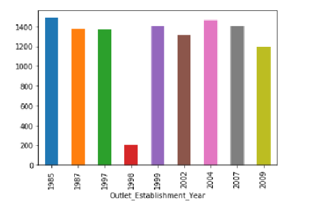

# ETL--BigMart Sales Data

# Background

This dataset describes the sales for BigMart which is a go-to grocery mart for all kinds of perishable and non-perishable food items. The data is divided into a train and test csv where the train csv has 8523 rows and 12 rows and test csv has 5681 rows and 11 columns. Here is the data dictionary describing each column.

# Goals

The goal is to extract the data from a reliable data source like Kaggle and bring it into the python environment with pandas as a csv and structure it into a pandas dataframe to begin the transformation phase of the data by cleaning the data, fixing the null and missing values , grouping by relevant variables to create visualizations and identify the outlets with maximum sales and the other trends and variables contributing to those sales. After the data is cleaned and fixed i will load the pandas dataframe into a local database such as postgreSQL and check for SQL tables with SQL commands.

# Process

Extract:

This dataset describes the sales for BigMart which is a go-to grocery mart for all kinds of perishable and non-perishable food items. The data is divided into a train and test csv where the train csv has 8523 rows and 12 rows and test csv has 5681 rows and 11 columns. On merging both the csv’s the total row count sums upto 14204 rows .

Transform: 

Merging the data we have 14204 rows and 13 columns of which 8 are categorical and 5 are numerical columns .

The column ‘item weight’ has 2439 missing values and ‘outlet size’ has 4016 missing values .

Column ‘item visibility’ has zero value errors that needs to be fixed.

Load: 

Create a table in my local postgres database with a ‘CREATE  TABLE’  query and import the csv into the table.

Import the create_engine function from sqlalchemy library.

Connect to the local database.

Confirm the data has been added by querying the table stored in postgres.

Make sql queries from the jpynb to perform C.R.U.D operations on the stored data.

# Findings

The scatterplot depicts that the $50 -100 MRP items are the most sold and thus most dense after which $150-200 MRP items are comparatively less dense and the items above $200 MRP are the least dense or are slow-moving in nature.

The boxplot shows that sales for meats , fruits and vegetables , dairy , snacks is high whereas seafood has the least sales.

Medium sized outlets are doing the maximum sales followed by high and small at an even rate.

Sales look to be similar for all the establishments that started operations in different year's except for the year 1998 that has the least sales.

